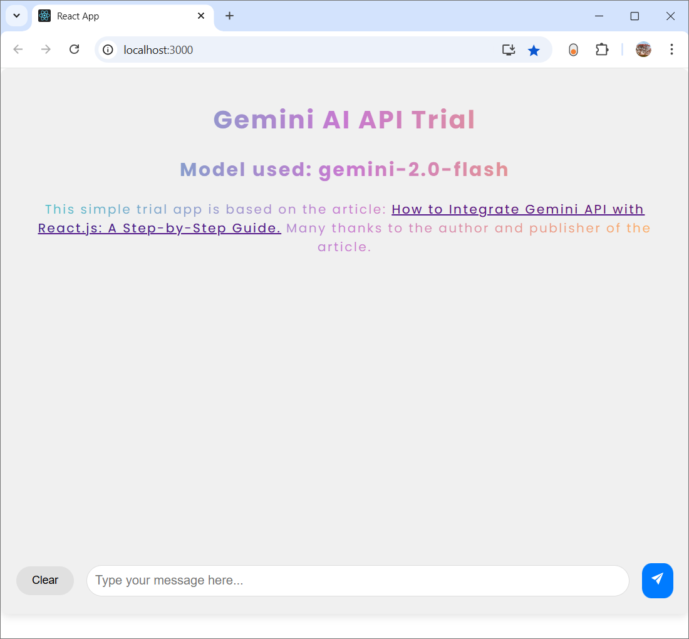
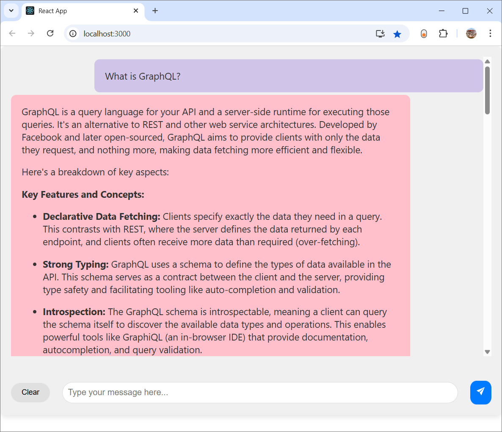
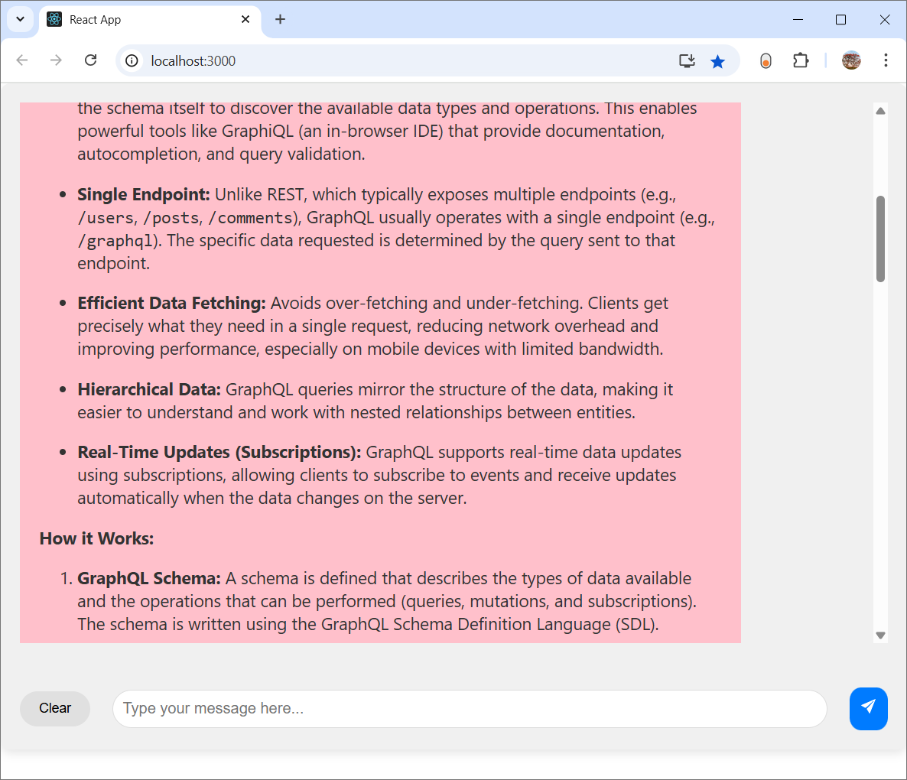

Simple React app using Google Gemini API
========================================

This project is based on the code from the article: [How to Integrate Gemini API with React.js: A Step-by-Step Guide.](https://dev.to/tahrim_bilal/how-to-integrate-gemini-api-with-reactjs-a-step-by-step-guide-341b) Many thanks to the author and publisher of the article.

I tested the app and it is working on localhost with a pretty decent user interface. Screenshots are given towards end of this README.

To get this repo's app running, after cloning the repo and npm install:\
Add your Google Gemini API key to .env file as:\
REACT_APP_GEMINI_API_KEY=YOUR-API-KEY

You may also have to change the .env variable REACT_APP_GEMINI_MODEL_NAME to a current model that works with your API key.\
Note that I do not have the time to test the above procedure to get the app running and so I may have missed some step.

The [How to Integrate Gemini API with React.js: A Step-by-Step Guide.](https://dev.to/tahrim_bilal/how-to-integrate-gemini-api-with-reactjs-a-step-by-step-guide-341b) article links to a [GitHub repo](https://github.com/Tahrim19/chatbot) and a [broken due to API key expiry, live site](https://chatbot-kappa-five.vercel.app/). This live site shows up the page but fails to get response from Gemini, with the browser console showing the error message, "API key expired. Please renew the API key."

Blog post associated with this app: [Google Gemini (AI) API has free tier; Could easily setup and run tutorial article React app using this API](https://raviswdev.blogspot.com/2025/04/google-gemini-ai-api-has-free-tier.html).

